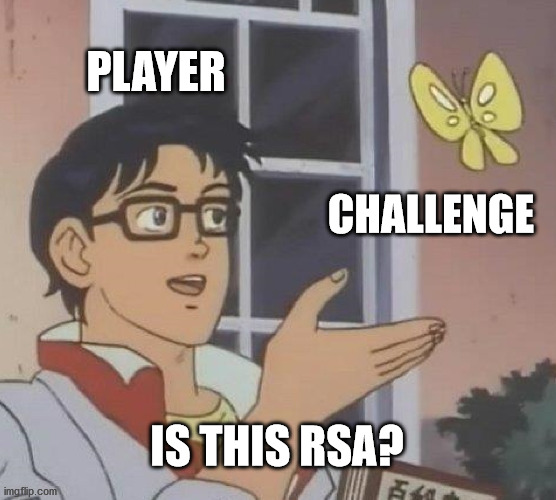

# Yet Another RSA

**Category**: Crypto

**Author**: rbtree

**Description**:

**Hints**: None

**Public Files**:
 * dist

**Solution**:
Read this paper: [https://eprint.iacr.org/2021/1160.pdf](https://eprint.iacr.org/2021/1160.pdf).

(Interesting fact: the suggested method in the paper should not work with small `m`. Somehow, it works on some randomly generated examples.)